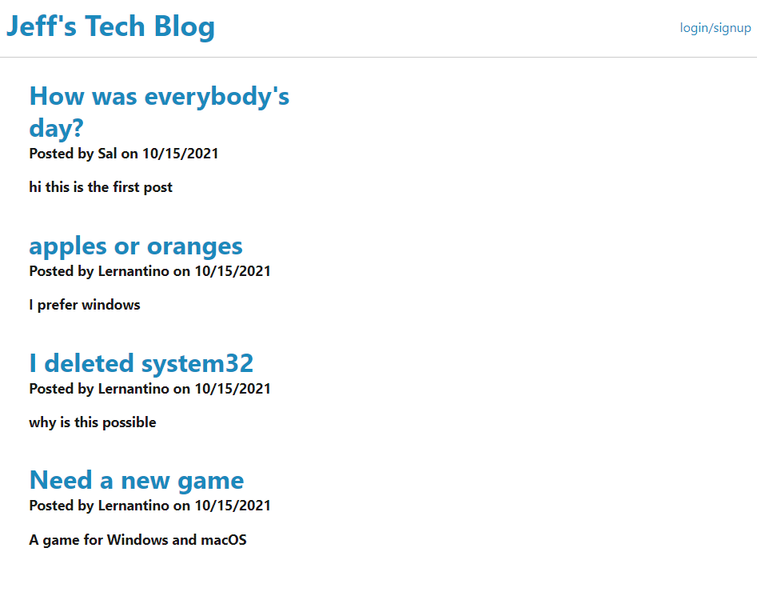
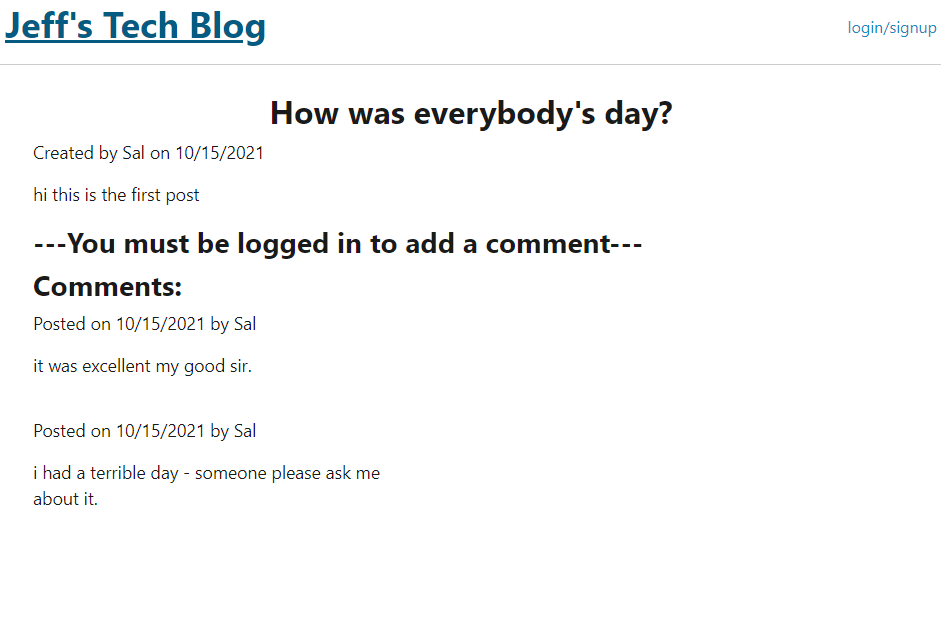
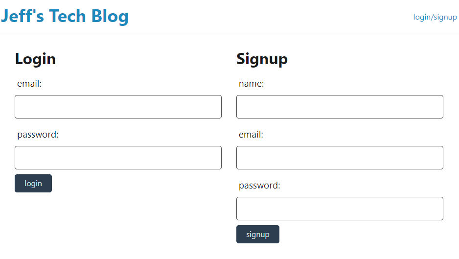
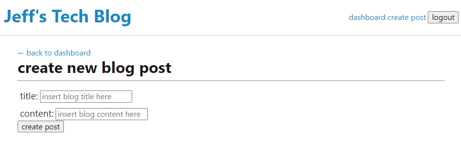
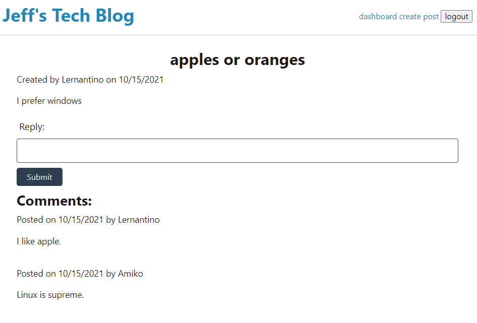

# Tech_Blog

## Description

Summary: This application allows users register and log in to post and reply to posts on a blog site.

check out the deployed application on: https://jeff51techblog.herokuapp.com/

## Table of Contents
  - [Description](#description)
  - [Installation](#installation)
  - [Usage](#usage)
  - [Licenses](#licenses)
  - [Tests](#tests)
  - [Technologies Used](#technologies-used)
  - [Questions](#questions)
  - [Screenshot](#screenshot)

## Installation

This app does not require an installation, and can be accessed via a web browser [here](https://jeff51techblog.herokuapp.com/
).

## Usage
To get started, the user can click on thread titles to view the full threads and replies.  
 They must be logged in in to add their own reply to the thread, which the user can do so with the login/signup button.  
After sucessful signup or log in, the user has access to the dashboard, and is able to see their own posts as well as create new posts.   
They are also able to reply to other threads.

## Licenses

Click [here](https://choosealicense.com/licenses/mit) for MIT license information

## Tests

Will be provided, TBD.

## Technologies Used

This application uses the following technologies: HTML, CSS, JavaScript, mySQL/Squelize, Node, Express, Heroku.

## Questions

Github: [This Repo](https://github.com/Jeffiftyone/Tech_Blog)
Email: [Email Address](jeffiftyone@gmail.com)

Please feel free to contact me for further questions via email, which is my preferred method.

## Screenshots
Home Page:

Replies by default:

Login/Signup:

Dashboard:

New Post:

Replies after logging in:

